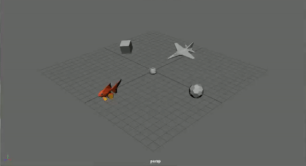

# MayaNGL : Maya-like viewport and controls using NGL

  

This is a demo that illustrates a Maya-like viewport experience using NGL. It uses similar shortcuts to switch between different tools and cameras.
It is also completely portable to other NGL demos - just copy the "MayaNGL" directory from this project's "include/", "src/" and "shaders/" into your own project and look at this demo's NGLScene.h/.cpp on how to use it.

This demo supports/displays the following:

- Camera pan, track and dolly. (Shortcuts: Alt+LMB = pan, Alt+RMB = dolly, Alt+MMB = track)

- Camera focus on target object. (Shortcuts: f = focus on selected object, SPACE = reset to origin)

- Grid.

- Title text projection.

- Valid with ngl::VAOPrimitives and ngl::Obj using ngl::Mat4 and ngl::Transformation.

- Object selection via ray casting. (Visualize the ray and object intersection by setting "Select<true> m_select;" in MayaNGL.h)

- View axis.

- Gizmo to translate. (Multi selection and transformation using the Shift key)

## Future Work:

- Refactor Code

- Select: Create more Bounding Volumes (AABB, OBB, Cone, Convex Hull) and add them as a template arg to the make_selectable() function.

- Common: Replace the functions in the Common.h with native NGL functions.

- Handles: Create transformation handles for rotatiting and scaling selected objects.

- Model Matrix: Find a way to use only one model matrix for all selectable and movable primitives.

- Application: Create the demo as a gui to change mouse icon when <q,w,e,r> are pressed.

- Select: Remove the VariantPrim class and use shaders to show (wrap around) the selected model.
